# PyCITO-QGIS (A QGIS plugin to get PyCIOT data)

### 以下為本工具的使用說明。因為本工具需要使用中研院[陳伶志老師團隊](https://cclljj.github.io/)針對民生公共物聯網資料庫所開發的 [pyCIOT](https://pypi.org/project/pyCIOT/) 套件，所以請使用者先在 QGIS 的 python 環境中執行一些簡單的安裝語法

- - -
- 在Windows 工具列中，打開 QGIS 的 OSGeo4W Shell 指令視窗

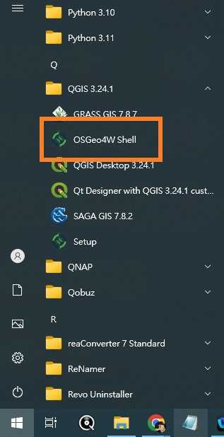

- 依序輸入 pip install --upgrade pip 與 pip install pyCIOT 以安裝 pyCIOT 套件


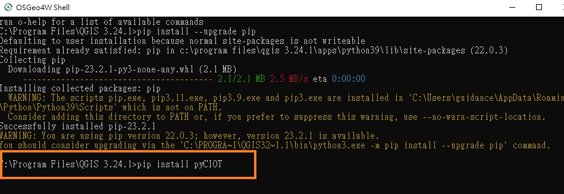
如果沒有出現任何紅色字體的錯誤，就表示已經成功安裝

- 打開 QGIS，並開啟 python console 

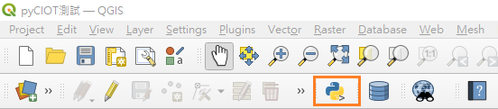

- 在python console 中輸入下列語法

```python
import pyCIOT
```
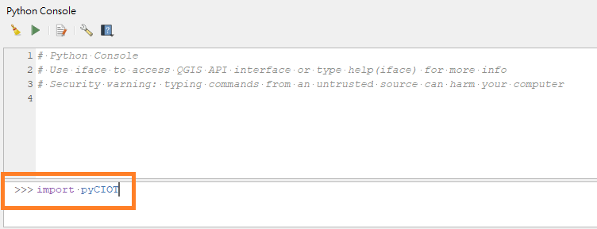

如果成功就會顯示下圖


- 安裝成功後，請到這個 github 專案右上 code icon 點選 Download zip，將這個外掛程式下載到你的電腦中

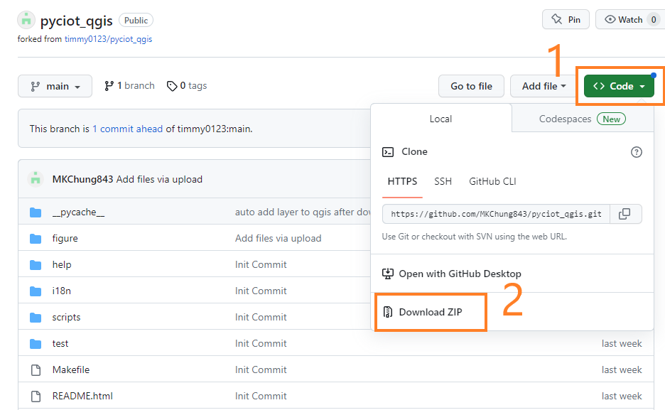

- 到 QGIS 點選 plugins，並選擇 Install from ZIP 的選項，導入剛剛下載的 zip 檔案

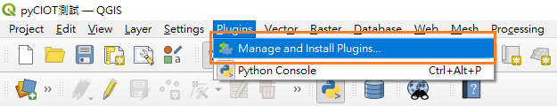

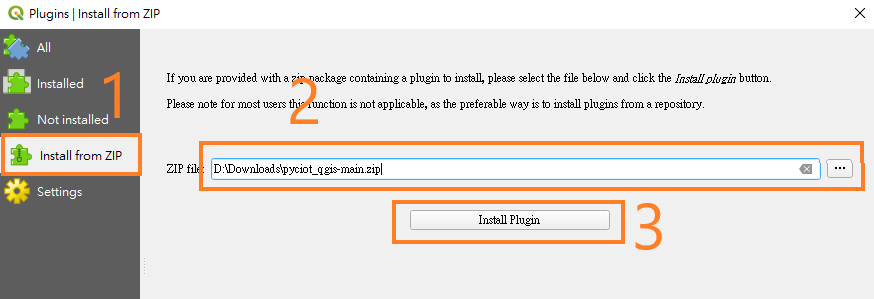

- 完成後，QGIS的工具列中，就會出現一個 CIOT (民生公共物聯網) 的 ICON

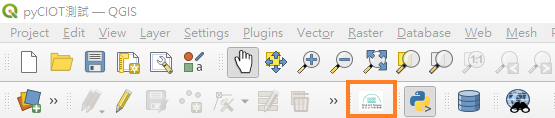

- 使用時，只需要打開 QGIS 內建的 OpenStreetMap 底圖 (XYZ Tiles) 並點選本工具後，即可框出需要資料的空間範圍

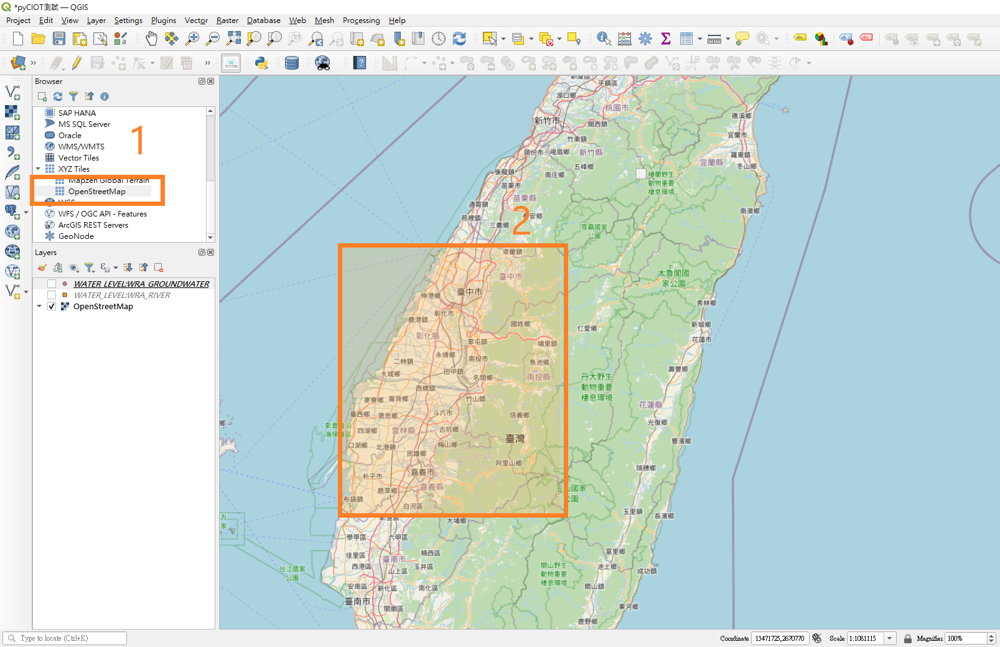

- 後續，選擇需要的感測器來源，並選定成果資料儲存的位置，本工具就會開始下載並轉檔

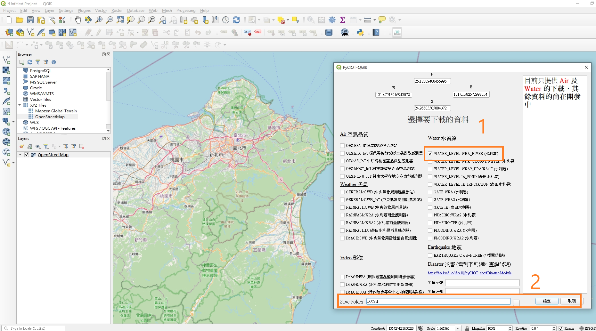

- 完成後，QGIS的畫面中，就會直接加入相關感測器的 Shp file (包括空間與屬性)

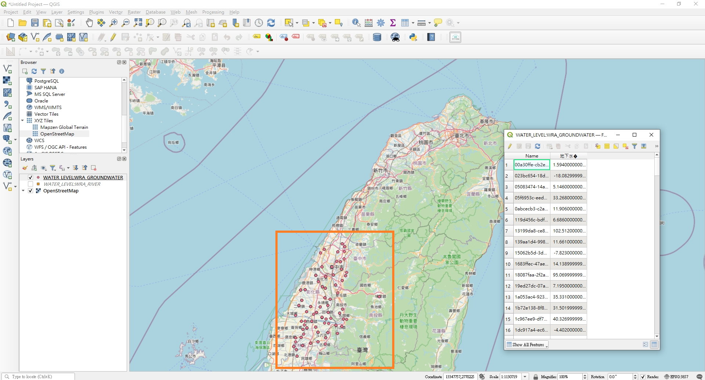
