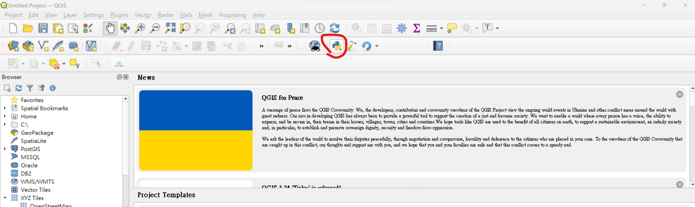
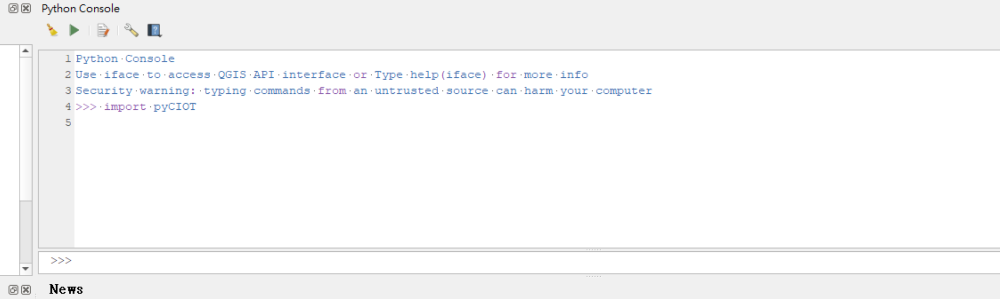
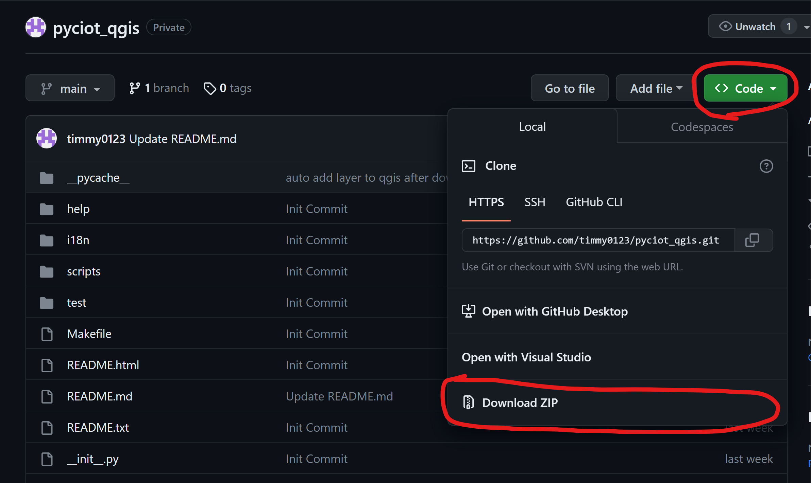
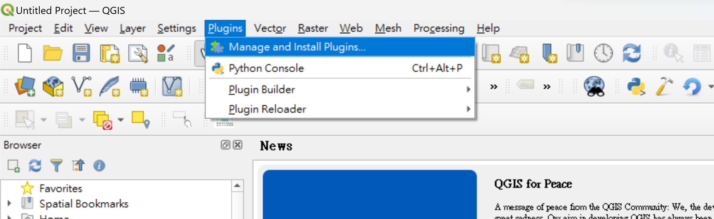
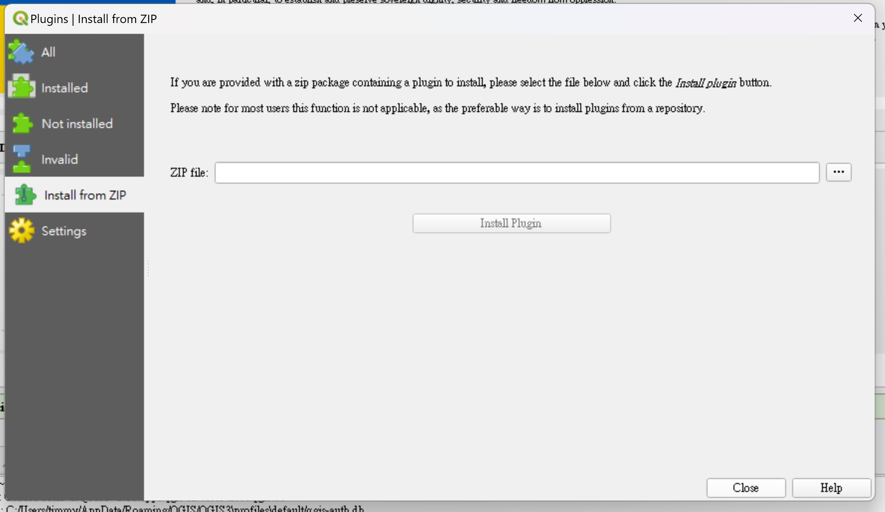

# PyCITO-QGIS (A QGIS plugin to get PyCIOT data)
## Install
在下載之前請先照下面方式確認是否安裝**pyCIOT**

- 在python console 中輸入下列語法


```python
import pyCIOT
```
如果安裝成功會顯示如下圖


如果安裝失敗請根據下列兩個網址安裝

1. [QGIS install package](https://landscapearchaeology.org/2018/installing-python-packages-in-qgis-3-for-windows/#:~:text=Installing%20Python%20packages%20in%20QGIS%203%20%28for%20Windows%29,your%20choice%3A%20python%20-m%20pip%20install%20%7Byour%20library%7D)

2. [pyCIOT](https://pypi.org/project/pyCIOT/)

- 安裝成功後請到右上 code icon 點選 Download zip


- 到QGIS點選plugins，然後點Install from ZIP


